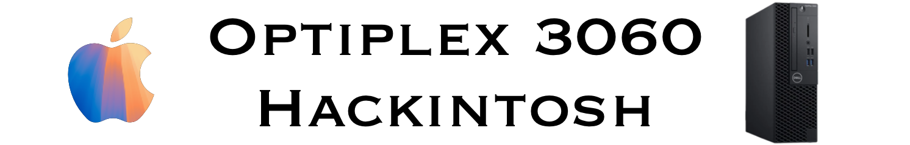

# 🚀 Optiplex 3060 Hackintosh EFI

## 🖥️ OpenCore 1.0.2 EFI for Optiplex 3060 supporting latest macOS Sequoia  

### 🌟 Overview

This repository contains the OpenCore EFI files required to run **macOS Sequoia** on a **Dell Optiplex 3060**.  
It’s designed to provide a **stable, optimized configuration**, allowing you to get the most out of your hardware when running macOS.

---

## 🏆 Badges  

  
  
  

---

## ⚡ Features  

✅ **Support for macOS Sequoia** – Compatible with the latest version of macOS Sequoia.  
✅ **OpenCore 1.0.2** – Uses the latest version of OpenCore, ensuring better compatibility and performance.  
✅ **Updated drivers and kexts** – Includes the latest drivers and kexts to ensure correct operation of the hardware.  
✅ **Optimized configuration** – Custom configuration for **Optiplex 3060**, offering the best performance and stability.  

---

## 🛠️ System Specs  

| Component              | Specification          |
|------------------------|-----------------------|
| **Processor**         | Intel Core i5-8400T   |
| **iGPU**              | Intel HD Graphics 630 |
| **RAM**               | 8GB                   |
| **Hard Drive**        | 256GB NVMe SSD        |
| **Wi-Fi & Bluetooth** | BCM94360CD            |

---

## 📷 Image Preview  

---

## 📥 Download & Installation  

1. **Download the EFI folder** from the repository:  
   👉 [Download EFI](EFI%20Sequoia%20Optiplex%203060.zip)  

2. **Format your USB drive** as `Mac OS Extended (Journaled)` with `GUID Partition Map`.  

3. **Copy the EFI folder** to the EFI partition of your USB drive.  

4. **Boot your system** using the USB and select `macOS Installer`.  

5. **Follow the macOS installation steps** and enjoy macOS Sequoia on your Optiplex 3060!  

---

## 🔗 Credits  

- **OpenCore Team** – For their amazing bootloader.  
- **Hackintosh Community** – For continuous support and development.  

---

🔹 *This repository is maintained for educational purposes only. Use it at your own risk.*  